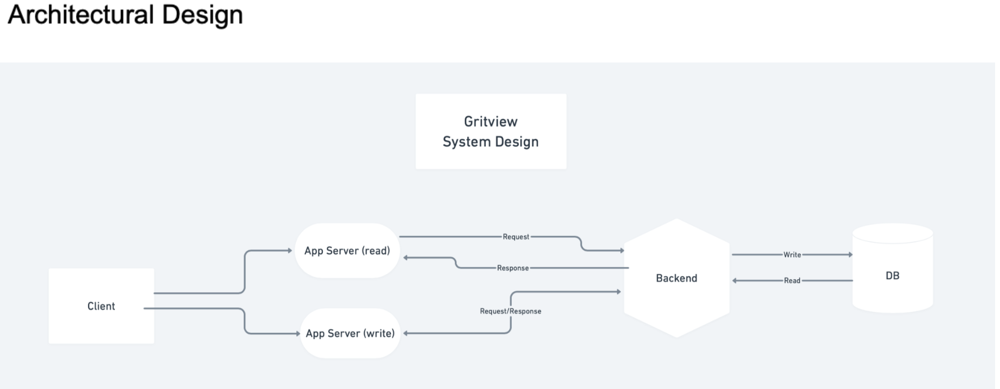
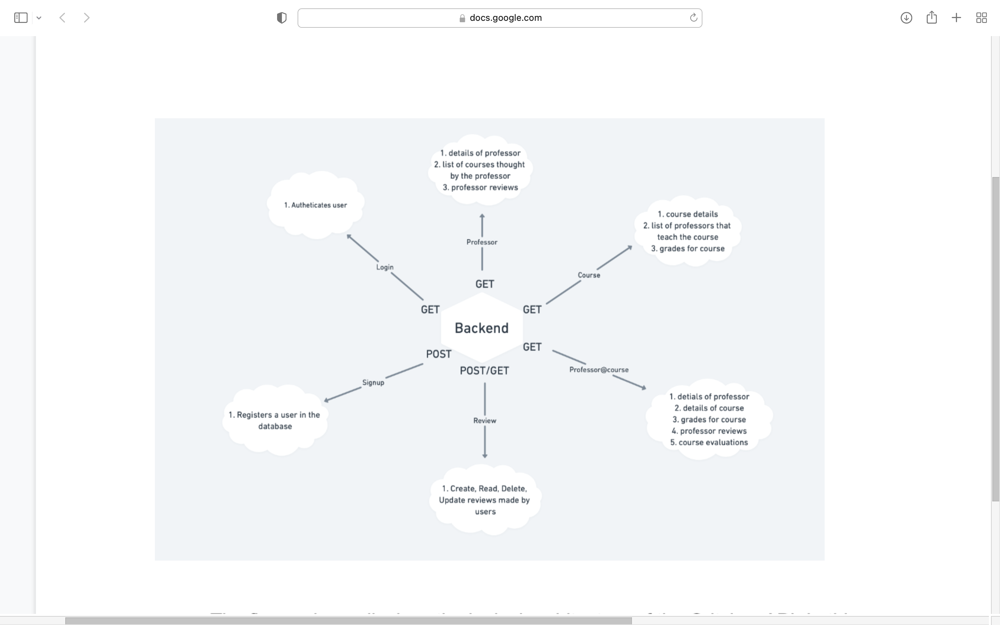

# Gritview Professor Rating App for UMBC 

System Design Document:

The purpose of this document is to detail the capabilities of our software product. This document will illustrate and describe the makeup of the backend software 
for Gritview, a platform that provides end-users with structured data containing grade distribution, course evaluations, course details, professor details and 
reviews based on queries provided via the endpoints.

The figure above displays the logical architecture of the Gritview API. In this system design, the client can make requests to read or write data, the user’s request is sent to the app server and then stored or retrieved from the database. When a client wishes to view information regarding details of a course, details of a professor, grades received in a course or evaluations, a request is received by the app server and in collaboration with our API, it queries the database in order to get the information corresponding to the request.

# DataBase 

To create this backend system, we used Python along with Flask which served as our web framework. To develop the database, we used PostgreSQL. Throughout the development of this system, we utilized the Agile Scrum methodology. 

# Requirement Matrix

##References

University of Maryland, Baltimore County (2020). Grade and Course Evaluation Data, 202001 [Csv]. Baltimore: UMBC.
PlanetTerp. (2017). mock data [Csv]. College Park: PlanetTerp.
PlanetTerp. (2020). PlanetTerp. Retrieved November 04, 2020, from https://planetterp.com/
